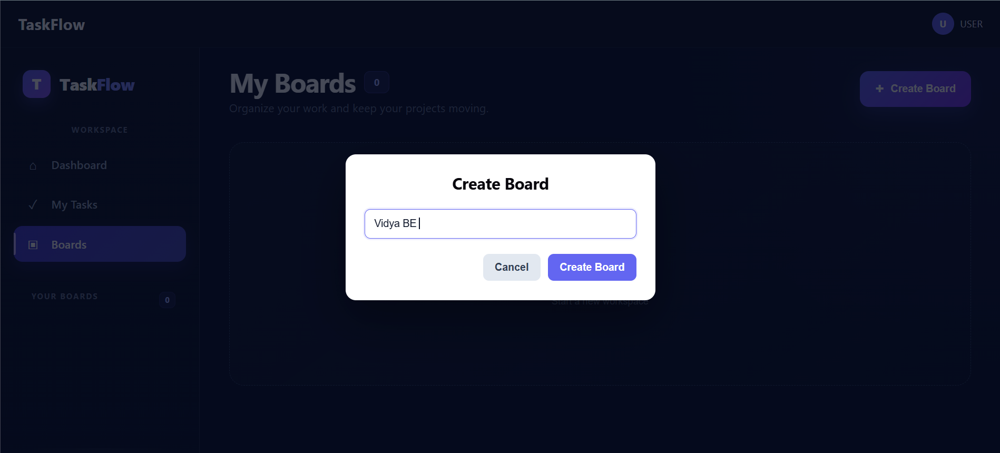
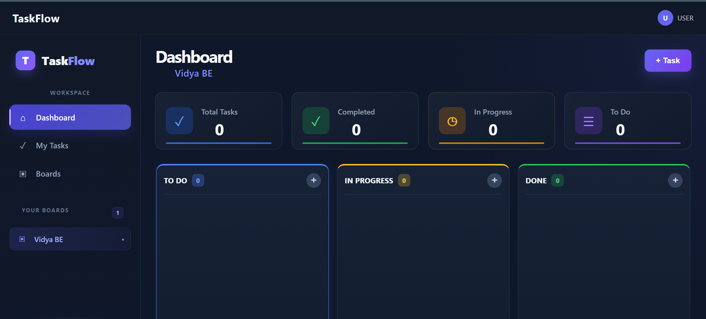
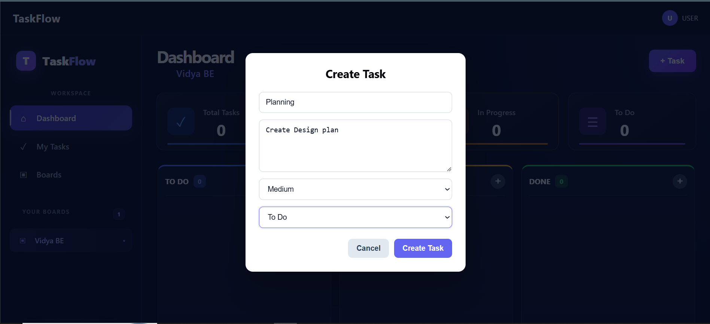
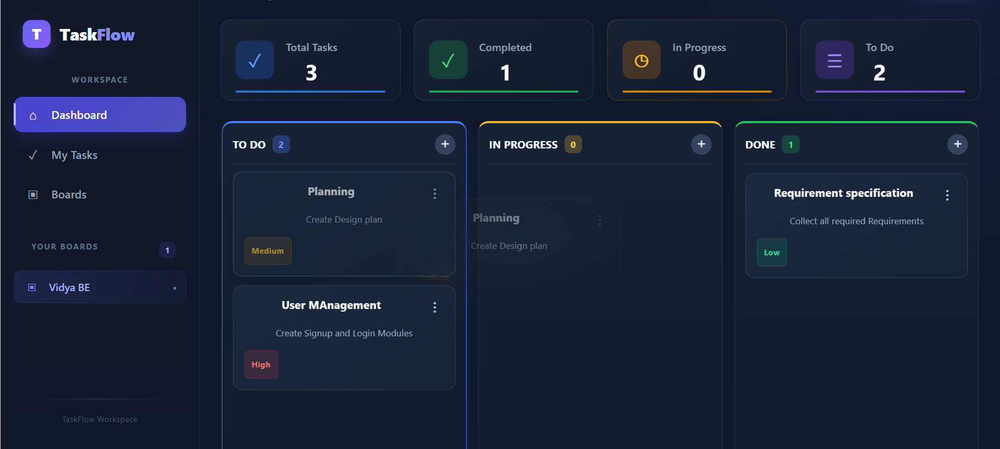
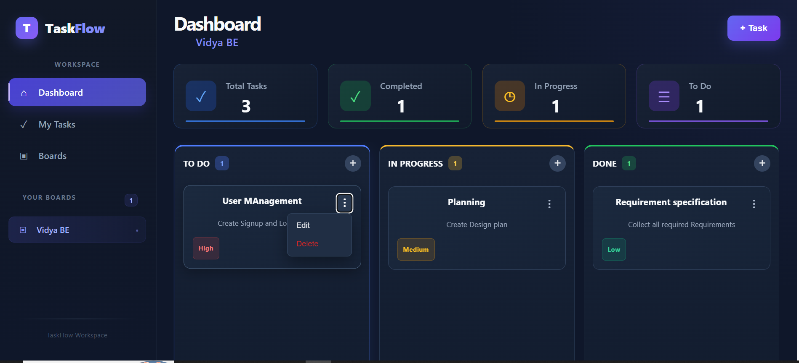
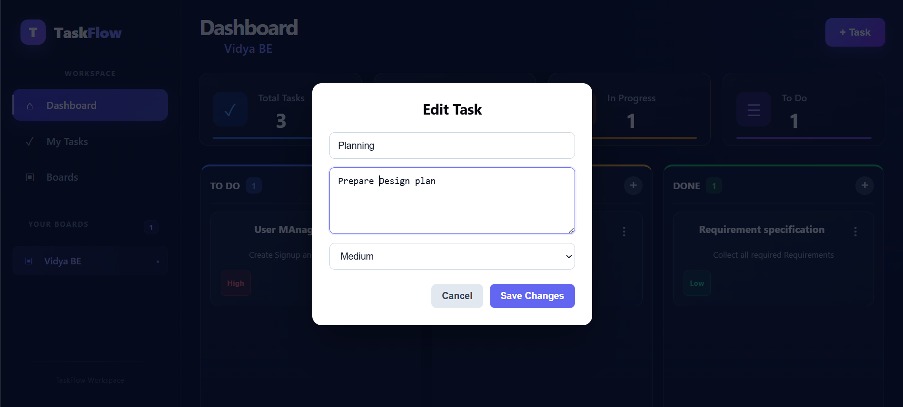
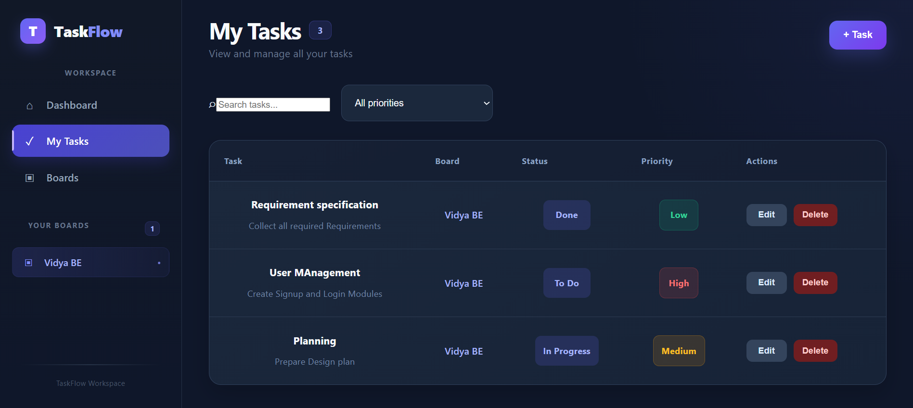
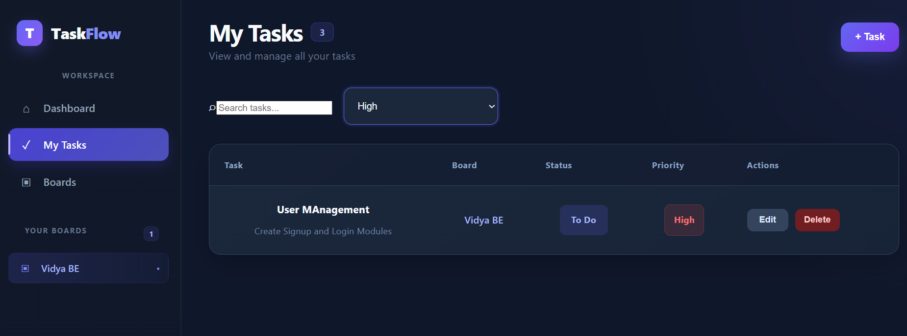
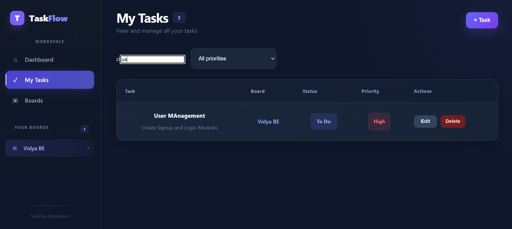
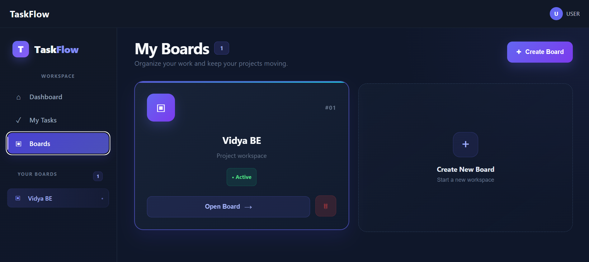

### Github Repo URl
```text
https://github.com/sadath1913/TaskFlow
```
### Github User Name
```text
sadath1913
```
### Deployment URl
```text
https://task-flow-rho-virid.vercel.app/
```
--- 

# TaskFlow

TaskFlow is a full-stack task and project management application built around boards and Kanban workflows. Users can create multiple boards, organize tasks into workflow columns, set priorities, create/edit/delete tasks, move tasks using drag and drop, and manage tasks from a centralized **My Tasks** page.

## Table of Contents

- [Short Description](#short-description)
- [Project Overview](#project-overview)
- [Key Features](#key-features)
- [Result / Output](#result--output)
- [Technology Stack](#technology-stack)
- [System Requirements](#system-requirements)
- [Project Structure](#project-structure)
- [Setup](#setup)
- [Running the Project](#running-the-project)
- [Deployment](#deployment)
- [Application Workflow](#application-workflow)
- [Core Functionality](#core-functionality)
- [API Overview](#api-overview)
- [Data Relationship](#data-relationship)
- [Frontend State Flow](#frontend-state-flow)
- [Testing Checklist](#testing-checklist)
- [Troubleshooting](#troubleshooting)
- [Git Workflow](#git-workflow)
- [Future Improvements](#future-improvements)
- [License](#license)

---

## Short Description

**TaskFlow is a modern Kanban-based task management application that helps users manage projects, boards, workflow columns, and tasks from an interactive dashboard.**

The application provides board-specific task management, task search and filtering, drag-and-drop task movement, task editing/deletion, persistent board selection, and a responsive dark-themed interface.

---

## Project Overview

TaskFlow follows a simple hierarchy:

```text
Board
  |
  +-- Column
        |
        +-- Task
```

Example:

```text
TaskFlow Project
│
├── To Do
│   ├── Create Task API
│   └── Design Login
│
├── In Progress
│   └── Build React UI
│
└── Done
    └── Setup Database
```

A task belongs to a column through `column_id`. A column belongs to a board through `board_id`.

Therefore:

```text
Task
  |
  +-- column_id
        |
        +-- Column
              |
              +-- board_id
                    |
                    +-- Board
```

---

# Key Features

### Dashboard
- Current board display
- Task statistics
- Kanban columns
- Task cards
- Priority indicators
- Add Task button
- Drag-and-drop task movement
- Edit/Delete task actions

### Board Management
- Create boards
- Open boards
- Delete boards
- Switch between boards
- Persist selected board using `localStorage`

### Task Management
- Create tasks
- Edit tasks
- Delete tasks
- Assign priorities
- Assign tasks to columns
- Move tasks between columns

### My Tasks
- Display tasks for the selected board
- Search tasks by title/description
- Filter by priority
- Edit/delete tasks
- Create a task directly from My Tasks

---
# Result / Output

The following screenshots demonstrate the main features and workflows implemented in TaskFlow.

## 1. Create Board



Create a new workspace board for organizing and managing tasks.

## 2. Dashboard



Main dashboard displaying the selected board, task statistics, and Kanban workflow.

## 3. Create Task



Create a new task by providing the task title, description, priority, and board column.

## 4. Move Task



Move tasks between Kanban columns using the drag-and-drop workflow.

## 5. Edit / Delete Task



Task status is updated when a task is moved to another workflow column.
Task actions allow users to edit or delete an existing task directly from the task interface.

## 6. Edit Task



Edit an existing task and update its title, description, priority, or status.


## 7. My Tasks



My Tasks provides a centralized view of tasks with their board, status, priority, and available actions.

## 8. Search and Priority Filter



Filter tasks by priority and quickly find relevant tasks.

## 9. Task Search



Search tasks by entering part or all of the task title or description.

## 10. My Boards 



Manage all available boards from a centralized interface. Users can create new boards, open existing boards, select the active board, and delete boards when they are no longer required.

---

# Technology Stack

## Frontend

- React
- JavaScript
- React Router
- Axios
- CSS
- HTML5 Drag and Drop API
- Browser Local Storage

Important React concepts used:

- Functional components
- `useState`
- `useEffect`
- `useMemo`
- Component props
- Conditional rendering
- API integration
- Client-side state management

## Backend

- Python
- FastAPI
- Pydantic
- REST API
- Relational database

## Development Tools

- Git
- GitHub
- Visual Studio Code
- Postman
- Browser Developer Tools

---

# System Requirements

Install the following before running the application.

### Required

```text
Git
Python 3.10+
Node.js
npm
Modern web browser
```

Check installations:

```bash
git --version
python --version
node --version
npm --version
```

---

# Project Structure

A typical structure is:

```text
TaskFlow/
     ├── backend/
     │   check_db.py
     │   check_fk.py
     │   init_db.py
     │   requirements.txt
     │   schema.sql
     │   seed.py
     │   taskflow.db
     │   
     ├───app
     │   │   database.py
     │   │   logging_config.py
     │   │   main.py
     │   │   models.py
     │   │   __init__.py
     │   │   
     │   └───__pycache__
     │           database.cpython-314.pyc
     │           logging_config.cpython-314.pyc
     │           main.cpython-314.pyc
     │           models.cpython-314.pyc
     │           __init__.cpython-314.pyc
     │           
     ├───DAO
     │   │   board.py
     │   │   column.py
     │   │   task.py
     │   │   __init__.py
     │   │   
     │   └───__pycache__
     │           board.cpython-314.pyc
     │           column.cpython-314.pyc
     │           task.cpython-314.pyc
     │           __init__.cpython-314.pyc
     │           
     ├───handlers
     │   │   board.py
     │   │   column.py
     │   │   task.py
     │   │   __init__.py
     │   │   
     │   └───__pycache__
     │           board.cpython-314.pyc
     │           column.cpython-314.pyc
     │           task.cpython-314.pyc
     │           __init__.cpython-314.pyc
     │           
     ├───schemas
     │   │   board.py
     │   │   column.py
     │   │   task.py
     │   │   __init__.py
     │   │   
     │   └───__pycache__
     │           board.cpython-314.pyc
     │           column.cpython-314.pyc
     │           task.cpython-314.pyc
     │           __init__.cpython-314.pyc
     │           
     └───tests
│
├── frontend/
│   ├── src/
│   │   ├── components/
│   │   │   ├── Header.jsx
│   │   │   ├── BoardSelector.jsx
│   │   │   ├── Sidebar.jsx
│   │   │   ├── TaskForm.jsx
│   │   │   ├── EditTaskForm.jsx
│   │   │   └── KanbanBoard.jsx
│   │   │
│   │   ├── pages/
│   │   │   ├── Dashboard.jsx
│   │   │   ├── MyTasks.jsx
│   │   │   └── Boards.jsx
│   │   │
│   │   ├── services/
│   │   │   └── api.js
│   │   ├── assets/
│   │   │   └── image.png ...
│   │   │
│   │   ├── styles/
│   │   │   ├── kanban.css
│   │   │   ├── sidebar.css
│   │   │   ├── boards.css
│   │   │   └── ...
│   │   │
│   │   └── App.jsx
│   │
│   ├── package.json
│   └── ...
│
│
└── README.md
```

Adjust the backend structure to match the actual repository if its module names differ.

---

# Setup

## 1. Clone the Repository

```bash
mkdir taskflow
cd taskFlow
git clone https://github.com/sadath1913/TaskFlow.git

```

---

# Backend Setup

## 2. Create Virtual Environment

### Windows

```bash
python -m venv venv
venv\Scripts\activate
```

### Linux/macOS

```bash
python3 -m venv venv
source venv/bin/activate
or
./venv/Scripts/activate.ps1 
```

## 3. Open Backend

```bash
cd backend
```


## 4. Install Dependencies

```bash
pip install -r requirements.txt
```

## 5. Configure Environment

If the backend uses environment variables, create:

```text
.env
```

Example:

```env
DATABASE_URL=sqlite:///./taskflow.db
```

Use the actual variables required by the backend.

Never commit secrets or credentials.

## 6. Start Backend

For a FastAPI application:

```bash
uvicorn app.main:app --reload
```

Backend:

```text
http://127.0.0.1:8000
```

API documentation:

```text
http://127.0.0.1:8000/docs
```

---

# Frontend Setup

Open a second terminal.

```bash
cd frontend
```

Install dependencies:

```bash
npm install
```

If the project uses an environment variable for the API:

```env
VITE_API_URL=http://127.0.0.1:8000
```

Otherwise configure the API base URL in the project's API service.

Start the frontend:

```bash
npm run dev
```

Vite normally provides a URL similar to:

```text
http://localhost:5173
```

---

# Running the Project

Two terminals are required.

### Terminal 1

```bash
cd backend
venv\Scripts\activate
uvicorn app.main:app --reload
```

### Terminal 2

```bash
cd frontend
npm run dev
```

Open the frontend URL shown by Vite.

---

# Deployment

TaskFlow is deployed using separate platforms for the frontend and backend.

- **Frontend:** Vercel
- **Backend:** Render
- **Database:** SQLite

## Deployment URLs

- **Frontend:** https://task-flow-rho-virid.vercel.app/
- **Backend:** https://taskflow-4ps0.onrender.com/

## Deployment Steps

### Frontend Deployment

1. Push the project to GitHub.
2. Import the GitHub repository into Vercel.
3. Set the **Root Directory** to:

   ```text
   frontend
   ```

4. Configure the production environment variable:

   ```env
   VITE_API_URL=https://taskflow-4ps0.onrender.com
   ```

5. Deploy the Vite frontend.

### Backend Deployment

1. Push the backend code to GitHub.
2. Import the GitHub repository into Render.
3. Configure the backend service to use the **backend** directory.
4. Install dependencies using:

   ```bash
   pip install -r requirements.txt
   ```

5. Start the FastAPI application using:

   ```bash
   uvicorn app.main:app --host 0.0.0.0 --port $PORT
   ```

6. Configure **CORS** to allow requests from the deployed Vercel frontend.
7. Deploy the backend.

The deployed frontend communicates with the Render backend through the `VITE_API_URL` environment variable.
---

# Application Workflow

```text
Start Application
       |
       v
Load Boards
       |
       v
Select Board
       |
       v
Load Columns
       |
       v
Load Tasks
       |
       v
Dashboard
       |
       +----------------------+
       |                      |
       v                      v
Create Task              Manage Task
                              |
                    +---------+---------+
                    |         |         |
                   Edit     Delete     Move
                    |         |         |
                    +---------+---------+
                              |
                              v
                         Updated UI
```

---

# Core Functionality

## Board Creation

```text
Create Board
     |
     v
POST /boards
     |
     v
Backend creates board
     |
     v
Frontend adds board
     |
     v
New board selected/opened
```

## Board Switching

When a board changes, the application:

1. Updates `selectedBoardId`
2. Saves the ID to local storage
3. Clears old columns
4. Clears old tasks
5. Fetches the new board's columns
6. Fetches tasks belonging to the new board
7. Displays only the selected board's data

Conceptually:

```text
Board A
  |
  | switch
  v
Clear Board A state
  |
  v
Board B selected
  |
  v
Load Board B columns
  |
  v
Load Board B tasks
  |
  v
Display Board B
```

## Persistent Selection

The selected board is stored as:

```text
selectedBoardId
```

using:

```js
localStorage.setItem(
  "selectedBoardId",
  String(boardId)
);
```

On refresh, the application checks whether that board still exists.

---

# Task Creation Flow

```text
Click + Task
     |
     v
TaskForm
     |
     v
Enter title
Enter description
Select priority
Select column
     |
     v
Submit
     |
     v
createTask(payload)
     |
     v
POST /tasks
     |
     v
Database
     |
     v
Created task response
     |
     v
Update frontend
```

Example payload:

```json
{
  "title": "Build Login API",
  "description": "Create authentication endpoint",
  "priority": "High",
  "column_id": 3
}
```

---

# Task Editing Flow

```text
Click Edit
     |
     v
EditTaskForm
     |
     v
Modify task
     |
     v
Update API
     |
     v
Backend
     |
     v
Updated task
     |
     v
Update App state
     |
     v
Update My Tasks
```

The UI is updated without requiring a full page refresh.

---

# Task Deletion Flow

```text
Click Delete
     |
     v
Confirmation
     |
     v
DELETE /tasks/{id}
     |
     v
Backend deletes task
     |
     v
Frontend removes task
```

---

# Drag and Drop Flow

```text
Drag Task
    |
    v
Store task ID
    |
    v
Drop on target column
    |
    v
onMoveTask(taskId, targetColumnId)
    |
    v
moveTask()
    |
    v
Backend updates column_id
    |
    v
Frontend moves task
```

---

# My Tasks

My Tasks loads tasks for the currently selected board.

The important operation is conceptually:

```js
getBoardTasks(selectedBoardId)
```

The page then:

1. Loads tasks
2. Loads columns
3. Maps each task to its column
4. Maps the column to its board
5. Displays the task table
6. Applies search and priority filters

---

# Search and Filtering

Search checks:

```text
Task title
Task description
```

Example:

```text
Search: sa
```

The page displays matching tasks.

Priority filtering supports:

```text
All priorities
High
Medium
Low
```

Filtering is performed on the tasks already loaded for the selected board.

---

# API Overview

The frontend API service contains operations similar to:

```text
getBoards()
getBoardColumns(boardId)
getBoardTasks(boardId)
getColumnTasks(columnId)

createBoard(data)
deleteBoard(boardId)

createTask(data)
deleteTask(taskId)
moveTask(taskId, columnId)
```

Typical REST endpoints are:

```text
GET    /boards
POST   /boards
DELETE /boards/{board_id}

GET    /boards/{board_id}/columns
GET    /boards/{board_id}/tasks

GET    /columns/{column_id}/tasks

POST   /tasks
PUT    /tasks/{task_id}
DELETE /tasks/{task_id}
```

Verify the exact endpoint paths against the backend implementation.

---

# Data Relationship

The main relationship is:

```text
Board
  |
  | 1:N
  v
Column
  |
  | 1:N
  v
Task
```

Example task:

```json
{
  "id": 5,
  "column_id": 3,
  "title": "Build Login API",
  "description": "Create authentication endpoint",
  "priority": "High"
}
```

The board is determined through:

```text
Task
  |
  +-- column_id
        |
        +-- Column
              |
              +-- board_id
                    |
                    +-- Board
```

This relationship is also important for ensuring that My Tasks shows only tasks belonging to the selected board.

---

# Frontend State Flow

The main application state is maintained in `App.jsx`.

Important state:

```js
boards
selectedBoardId
columns
tasks
editingTask
updatedTask
```

### Board state

```text
boards
   |
   +-- selectedBoardId
```

### Dashboard state

```text
selectedBoardId
      |
      v
columns
      |
      v
tasks
```

### Edit state

```text
editingTask
      |
      v
EditTaskForm
      |
      v
updatedTask
      |
      v
Dashboard + MyTasks
```

---

# Testing

TaskFlow includes both automated backend tests and manual frontend validation.

## Backend Automated Tests

Backend tests are implemented using `pytest`, FastAPI `TestClient`, and a separate SQLite test database.

Run the tests from the `backend` directory:

```bash
pytest -v
```
---

# Troubleshooting

## 422 Unprocessable Content

A `422` response normally means the backend validation rejected the request.

Check:

```text
Request URL
Request method
Request payload
Content-Type
Backend schema
```

In Chrome:

```text
DevTools
→ Network
→ POST /tasks
→ Payload
```

Compare the actual browser payload with a working Postman request.

Example:

```json
{
  "title": "Build Login API",
  "description": "Create authentication endpoint",
  "priority": "High",
  "column_id": 3
}
```

If Postman succeeds but React receives 422, inspect the frontend `createTask()` function and the actual Network request rather than relying only on a console-logged JavaScript object.

## Tasks from Previous Board Appear

Verify:

```text
selectedBoardId
```

changes correctly.

Clear old data during board switching:

```js
setColumns([]);
setTasks({});
```

Then fetch the new board's data.

## My Tasks Shows No Tasks

Check:

```text
selectedBoardId
```

Then verify:

```js
getBoardTasks(selectedBoardId)
```

returns data.

Also verify:

```text
task.column_id
column.id
column.board_id
board.id
```

are consistent.

## Edited Task Does Not Update

Verify the returned task has the same:

```text
id
```

as the existing task.

The frontend update logic should match the task by ID.

## Refresh Loses Board Selection

Open:

```text
Browser DevTools
→ Application
→ Local Storage
```

Verify:

```text
selectedBoardId
```

exists and contains a valid board ID.

---

# Development Commands

## Frontend

```bash
npm install
npm run dev
npm run build
npm run preview
```

## Backend

```bash
python -m venv venv
venv\Scripts\activate
pip install -r requirements.txt
uvicorn app.main:app --reload
```

---

# Git Workflow

Initialize repository:

```bash
git init
```

Add files:

```bash
git add .
```

Commit:

```bash
git commit -m "Initial TaskFlow project"
```

Connect remote:

```bash
git remote add origin <URL>
```

Push:

```bash
git branch -M main
git push -u origin main
```

---

# Recommended .gitignore

```gitignore
# Python
venv/
__pycache__/
*.pyc

# Environment
.env

# Node
node_modules/
dist/

# Local database
*.db
*.sqlite
*.sqlite3

# IDE
.vscode/
.idea/

# OS
.DS_Store
Thumbs.db
```

---
# Development Notes

## Decisions and Assumptions

- SQLite was selected because it is sufficient for this lightweight task-management application and requires no separate database server.
- A task belongs to a column, and a column belongs to a board. Therefore, a task's board is determined through its column relationship.
- The selected board is persisted in browser localStorage so the user's selected board remains available after a page refresh.
- Validation is performed on both the frontend and backend. Frontend validation provides immediate feedback, while backend validation prevents invalid requests from bypassing the UI.
- Drag-and-drop was implemented for moving tasks between columns.

## What I Would Improve With More Time

- Add authentication and authorization.
- Add board member permissions.
- Add task due dates, labels, and comments.
- Add pagination and server-side search/filtering for larger datasets.
- Add more automated frontend tests.
- Add CI/CD automation.
- Deploy the application to a production environment.
- Use PostgreSQL for a production-scale deployment.

## Development Time

Approximately **[10]** were spent designing, implementing, testing, debugging, and documenting the application.

## What I Learned

One useful area I explored during development was implementing relational queries with SQLAlchemy rather than relying only on basic ORM retrieval methods. In particular, the task-count-per-column query uses joins, aggregation, grouping, and ordering directly at the database layer.
---

# Project Goals

TaskFlow demonstrates a complete full-stack workflow:

```text
React
  |
  v
Axios / REST API
  |
  v
FastAPI
  |
  v
Database
```

The project focuses on:

- Component-based React development
- REST API integration
- State management
- Board-specific data handling
- Kanban workflows
- Drag-and-drop interaction
- CRUD operations
- Search and filtering
- Persistent board selection
- Interactive UI design

---

# Author

**Sadath Khan**

**Project:** TaskFlow  
**Type:** Full-Stack Task Management / Kanban Application
